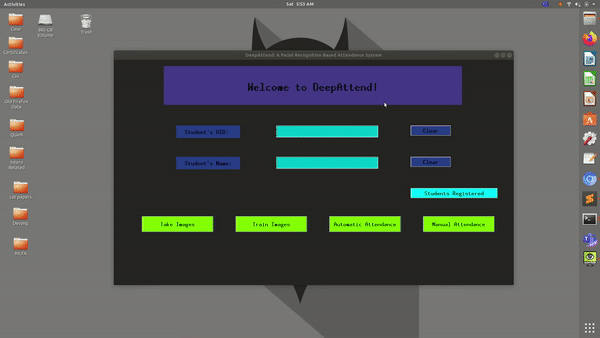
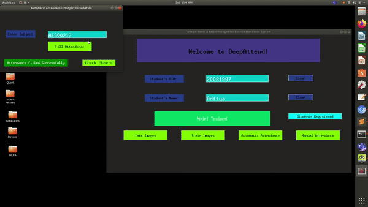
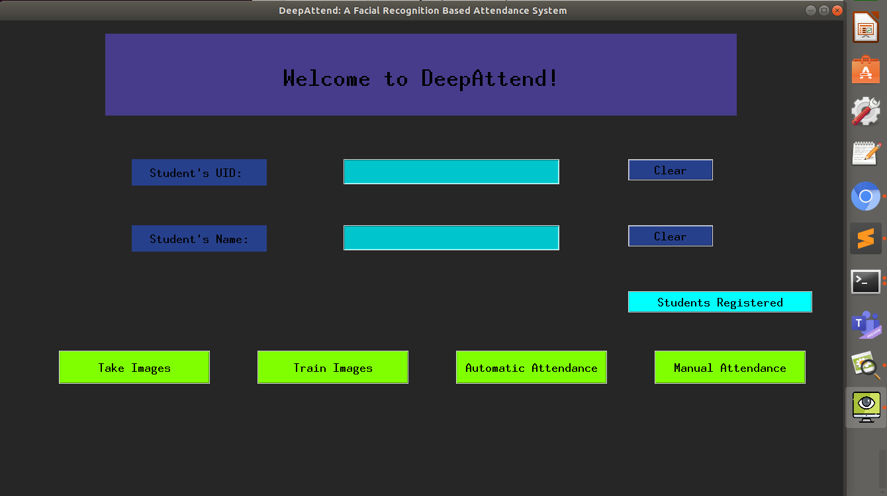
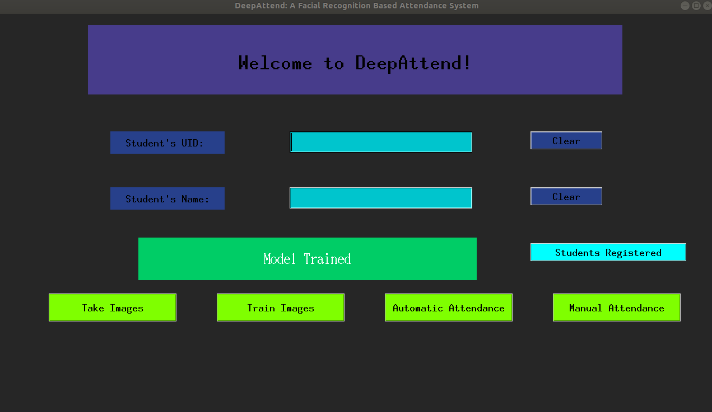
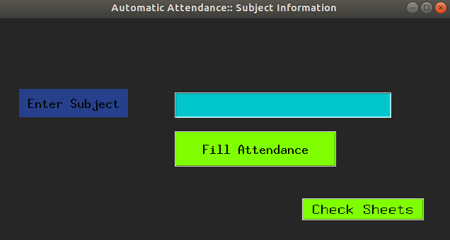
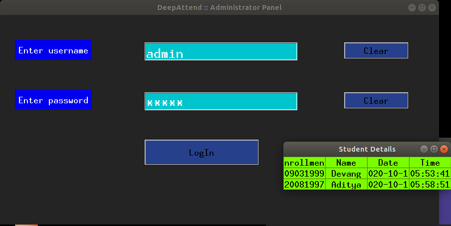

<h1> 
  DeepAttend:: Face Recognition Attendance System
</h1>

DeepAttend was developed for the *Machines Laboratory of IIT Kharagpur* by [**Devang Upadhyay**](https://www.linkedin.com/in/devangupadhyay/), a then third-year undergraduate there, under the guidance of **Prof. Mrigank Sharad**, **Prof. Manoj K Mondal** and **Prof. K. Pathak**.

## User Interface Flow


## Installation

1. Clone/Download the [repository](https://github.com/trident-dev/DeepAttend.git)
2. 
```bash
$ pip install requirements.txt
$ python DeepAttend_run.python
```

## Demonstration




## Views






## Changes made while making open-source

1. MongoDB connections and links have been completely removed here and databases have been made local
2. To view things in the Admin-Panel:: username - admin :: password - admin#
3. UID and other student information is no longer hashed

## Contributing
Pull requests are welcome. For major changes, please open an issue first to discuss what you would like to change

## License
[MIT](https://choosealicense.com/licenses/mit/)